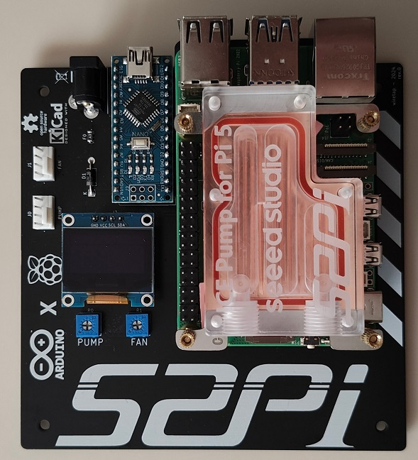
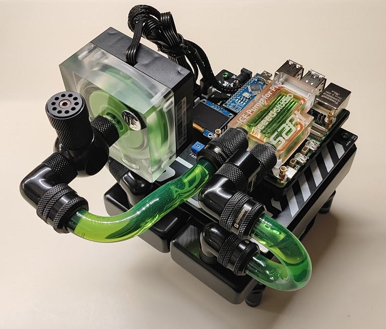

# Watercooled Pi5 Baseboard
A baseboard for setting up a watercooled Raspberry Pi 5.

\

\

## Info
In this repository you'll find my Watercooled Raspberry Pi 5 baseboard. It features mounts for the Raspberry Pi 2/3/4/5, an Arduino Nano, and a 120mm fan/radiator. The baseboard is powered through the 5.5x2.1mm 12V barrel jack, which powers the pump, fan, and Arduino. There is an onboard 4A fuse for protection. The Pi is powered separate with its own USB power input.\
\
The Arduino is used for the PWM fan and pump control so it leaves the entire Pi header available for hat use. \
\
Arduino Nano connections:\
A0: Pump Adjustment 10k trim pot input \
A1: Fan Adjustment 10k trim pot input \
A4: SDA for OLED screen (SSD1306 model) \
A5: SCL for OLED screen (SSD1306 model) \
D2: Pump tachometer input \
D6: Fan tachometer input \
D9: PWM pump demand output \
D10: PWM fan demand output
\
\
For the radiator and fan, you'll want to use some generic standoffs commonly found on Aliexpress, Amazon, or Ebay. These will all depend on your fan and radiator choices for what fits best. A 5mm standoff provides a sufficient gap between the board and radiator to allow airflow to pass through. After all, watercooling even a Raspberry Pi 5 is pointless and passive cooling alone is enough at the factory clockspeed. 
\
\
I'll leave the code up to your own creativity, but as-is, the board will run the pump and fan at 100% duty cycle so there are no worries about needing to program the Arduino right away. \
\
License: UNLICENSE -- do what you want with it.
